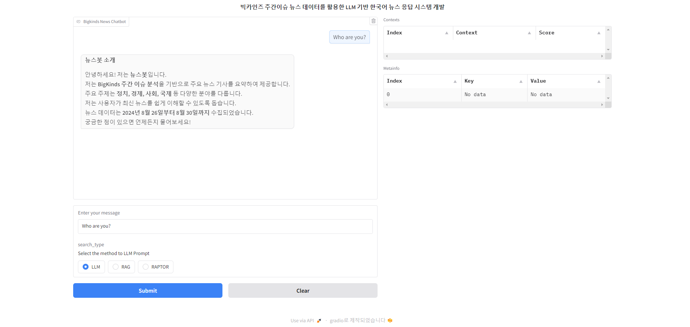

# RAPTOR를 활용한 LLM 기반 한국어 뉴스 응답 시스템 개발

본 연구는 **RAPTOR(Recursive Abstractive Processing for Tree-Organized Retrieval)** 기반의 질문 응답 시스템을 제안하며, 최신 정보 부족 및 환각 현상과 같은 대형 언어 모델(LLM)의 한계를 보완하는 연구를 다룹니다. 

비교 대상으로 **RAG(Retrieval-Augmented Generation)** 을 설정하여, 빅카인즈 주간 이슈 데이터를 벡터 데이터베이스로 임베딩하고, **LangChain**을 활용한 실험을 통해 두 기법의 성능을 비교 분석하였습니다. 

연구 결과, RAPTOR는 특히 추상적인 질문에 대해 더 우수한 성능을 발휘함을 확인했습니다.

## 주간 이슈 뉴스 데이터 수집 기간

**2024-08-26 ~ 2024-08-30**

[BIGKinds 주간이슈](https://www.bigkinds.or.kr/v2/news/weekendNews.do)

## 주간 이슈 뉴스 데이터 수집 방법

1. 날짜별로 주간 이슈에 있는 뉴스 데이터를 **빅 카인즈의 뉴스검색.분석에서 엑셀로 데이터 다운로드**

2. 각 엑셀에 있는 **토픽별 뉴스 데이터를 10개씩 수집** (날짜별로 토픽 10개 * 뉴스 10개씩 = 날짜별 100개 => 주간 총합 500개)

3.  5일 동안 수집한 데이터를 **RAG와 RAPTOR를 통해 Vector Store에 저장**
